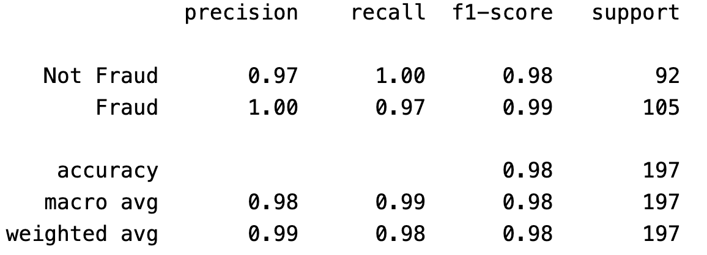

## Introduction
Credit card fraud, which causes significant economic losses worldwide, requires advanced detection techniques as digital transactions increase. This project addresses this by developing a machine learning system using logistic regression, random forest, and shallow neural networks to effectively identify fraud. Each model was chosen for its ability to handle binary classification and imbalanced datasets, enhancing transaction security for consumers and financial institutions.

## Data Preprocessing
It is important to normalize the data range before applying a machine learning algorithm. This is because: 1) Many ML algorithms work best when features have similar scales or ranges. 2) In cases of high variance in data ranges, numerical instability might occur. 3) Certain algorithms such as logistic regression, linear regression, and neural networks often assume that the input features are normally distributed. Here, I used *RobustScaler* from *sklearn* to normalize the data range. As we can see, after normalization, most of the features show a Gaussian distribution.

One of the major challenges in fraud detection is the highly imbalanced nature of the datasets, where fraudulent transactions are much rarer than legitimate ones. This imbalance can bias the model towards predicting the majority class, leading to high accuracy but poor recall for fraudulent transactions. To counteract this, I implemented an undersampling strategy, reducing the size of the majority class (legitimate transactions) to balance the dataset. This approach helps in enhancing the sensitivity of the models to fraudulent activities by giving equal importance to both classes during training.

## Logistic Regression Model
The first model I employed was logistic regression, a linear model that is particularly useful for binary classification tasks due to its simplicity and efficiency in producing probability-based outputs. Logistic regression was trained using a combination of features extracted from the transaction data and previously known fraud indicators. 
During training, the algorithm iteratively adjusts the weights to minimize the error (typically binary cross-entropy) between the predicted probabilities and the actual class labels. The process stops when the loss converges or meets a pre-set threshold.

To evaluate the effectiveness of the model, I focused on the F1 score as the primary metric. The F1 score is given by the harmonic mean of precision and recall.  Precision measures how many of the predicted positive instances are actually positive, while recall measures how many actual positive instances were correctly identified by the model. The F1 score is particularly useful in this project because we care equally about both false positives and false negatives. As we can see, the logistic regression model provides a very good result with very high precision and very high recall on the validation set. 

## Random Forest Model
Next, I utilized a random forest model. A random forest model is trained by constructing multiple decision trees on different subsets of the training data. For each tree, a random subset of the features is chosen at each node to determine the best split. This process reduces overfitting by creating diverse trees that are less likely to focus on noise in the data. Once all the trees are trained, the model makes predictions by using majority voting over results from all trees. 

I again calculate the F1 score over the validation set for the random forest model. We observe that this random forest model has a 100% precision, which means it has not made any false positive predictions on fraudulent transitions. 

## Shallow Neural Network
The third model explored was a shallow neural network, comprising a few layers to keep the computation manageable while still capturing nonlinear relationships in the data. The network included input, hidden, and output layers with activation functions tailored to enhance model performance on the classification task. The training involved backpropagation and gradient descent that iteratively adjust the weights of the network, aiming to minimize prediction errors.

## Test Set Evaluation

Upon evaluating all three models, the random forest emerged as the most effective, particularly chosen for its precision. When applied to the test set, it maintained high precision, confirming that all predicted cases of fraud were indeed fraudulent. However, a slight decrease in recall was observed, indicating that some fraudulent transactions were missed.

## Conclusion
The random forest model's superior performance on both the validation and test sets highlights its potential to effectively detect credit card fraud. Future work could explore more advanced machine learning techniques, such as deep learning models, and alternative data balancing strategies to further enhance model accuracy and recall.
