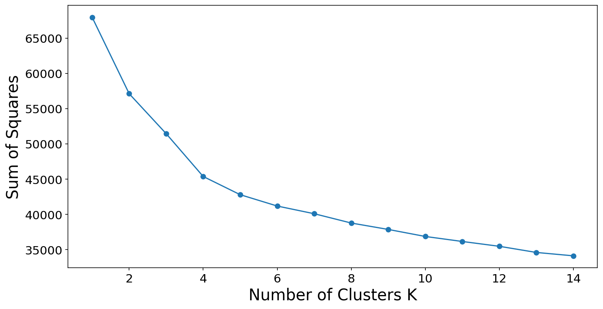

## Introduction
Galaxies, those vast and sprawling structures, dominate the universe and capture the curiosity of human beings. Understanding their shapes not only deepens our knowledge of the cosmos but also provides insights into their evolutions. In this portfolio project, I employed advanced machine learning techniques to classify galaxies based on their morphological features. Utilizing images from the Sloan Digital Sky Survey, this analysis was conducted on a dataset comprising twenty thousand galaxy images, each with a resolution of $69\times69$ pixels. The dataset can be accessed [here](https://www.astro.utoronto.ca/~bovy/Galaxy10/Galaxy10.h5). 

*<small>These 48 snapshots from the Sloan Digital Sky Survey show a diverse range of galaxy shapes, from spiraling whirls to elliptical enigmas.</small>*

## Feature Extraction with ResNet50
To tackle the complex task of galaxy classification, I began by employing a pre-trained convolutional neural network, ResNet. The ResNet architecture is one of the most widely used convolutional neural network (CNN) models for deep learning tasks. The core idea behind ResNet is its use of residual blocks. These blocks include "shortcuts" that allow the input of a layer to be added to the output of a layer deeper in the network. This architecture helps mitigate the vanishing gradient problem by allowing gradients to flow directly through the network during training. 

For this project, I utilized ResNet50, a variant comprising 50 layers, including convolutional, pooling, and fully connected layers. Originally, ResNet50 is trained to classify images into one of 1000 predefined categories, which notably do not include galaxies. Nevertheless, its architecture is versatile enough to be repurposed for galaxy image classification. By removing the final classification layer of ResNet50, I transformed the network from a general classifier into a dedicated feature extractor. This modification alters the network's output from a $1000$-dimensional label vector to a $1024$-dimesional feature vector tailored to capture the unique aspects of galaxy images.

The next step is to reduce the dimensionality of these feature vectors to make the clustering computationally feasible and more effective. Using Principal Component Analysis (PCA), I reduced the feature space while preserving approximately $90%$ of the original variance, resulting in a $58$-dimensional vector. Although the t-SNE visualization method provided initial insights into the distribution of these features, its tendency to misrepresent clustering necessitated the exploration of more robust clustering algorithms to accurately classify the various galaxy types.

## Clustering with K-means and Spectral Clustering method
With reduced feature vectors in hand, I applied two clustering methods: K-means and Spectral clustering. 

K-means clustering, a widely used and straightforward method, partitions a dataset into K distinct, non-overlapping clusters. It's a method that the audience is likely familiar with, as it's a popular choice in data analysis. It groups data points into clusters such that the total variance within each cluster is minimized. The K-means method starts by selecting $K$ initial cluster centroids, and assign each data point to the nearest centroids. Then, the locations of centroids are recalculated as the mean of all data points assigned to each cluster. The final cluster result is obtained by repeating the aforementioned steps.

In the K-means method, we need to determine the number of clusters $K$ in advance. I used the elbow method to determine the number of clusters. I ran K-means clustering on the galaxy dataset from $K = 1$ to $K=14$. I calculated the sum of squared errors within clusters for each number of clusters. It can be seen that the SSE begins to decrease more slowly after $K=4$, suggesting diminishing returns in variance reduction by increasing $K$. Thus, we choose $K=4$ in our clustering algorithm.

The K-means clustering method effectively categorized the galaxy images into four distinct groups, based on their morphological features. After visual inspection of representative images from each cluster, the first group was identified as Cigar-shaped galaxies, characterized by their elongated, narrow profiles. The second group consisted of Spiral galaxies, easily recognizable by their curved arms and central bulges. The third group encompassed Elliptical galaxies, noted for their more rounded, smooth appearances. Interestingly, the fourth group also comprised Elliptical galaxies but was distinct due to a higher presence of noise in the images, suggesting variations in image quality or background interference. These classifications demonstrate the utility of K-means in segmenting galaxy types, even when some groups exhibit subtle differences.

In this project, I also used the spectral clustering algorithm to classify galaxies. Spectral clustering is a versatile and powerful clustering technique, a fact that should pique the interest of the audience. It's particularly useful for grouping data that is not linearly separable. It works by using the eigenvalues of the Laplacian matrix derived from the data to reduce dimensions and perform clustering in a new space where the clusters are more apparent.

The first step of the spectral clustering algorithm is to construct a similarity graph to represent the data. I constructed the similarity graph in this project by connecting each data point with its $10$ nearest neighbors. Then, I applied the eigendecomposition to the Laplacian matrix of the constructed graph. The number of zero eigenvalues chosen typically corresponds to the number of clusters desired. In the new space formed by the eigenvectors with small eigenvalues, K-means are applied to perform the final clustering. This step assigns each data point to a specific cluster.

In the following plot, I showed the first $10$ eigenvalues of the Laplacian matrix. A gap between the fourth and fifth eigenvalues indicates four clusters in our dataset.

The spectral clustering approach also successfully categorized the galaxies into four distinct groups, but with a different ordering from the K-means method. This variation likely stems from the inherent randomness in the initialization stages of the clustering algorithms. In spectral clustering, the first group identified was the Cigar-shaped galaxies, similar to the K-means results. However, the second group consisted of Elliptical galaxies with standard features, while the third group included Elliptical galaxies characterized by more noise, suggesting variations in imaging conditions or extraneous data. The fourth group, uniquely ordered in this method, was composed of Spiral galaxies. The consistent identification of galaxy types across different clustering methods, despite the order variation, underscores the robustness of using advanced clustering techniques for astronomical classification.

## Future Directions

While the current project successfully utilizes features extracted via ResNet50 and PCA, future iterations could benefit from integrating additional features that capture other aspects of galaxies, such as shape, texture, and spectral characteristics. Advanced techniques in image processing and deep learning, such as autoencoders for unsupervised feature learning, might reveal more nuanced patterns that are not captured by the current model.

One might also want to improve classification performance by fine-tuning the pre-trained ResNet50 model on a galaxy-specific dataset. Initially, ResNet50 was not trained on galaxy images, which might limit its ability to capture all the relevant features effectively. By manually labeling a small but representative subset of the galaxy images, we can retrain or fine-tune the neural network. This process adjusts the weights of the network to better suit the specific textures, shapes, and other astronomical features present in galaxies, potentially leading to more accurate classifications.