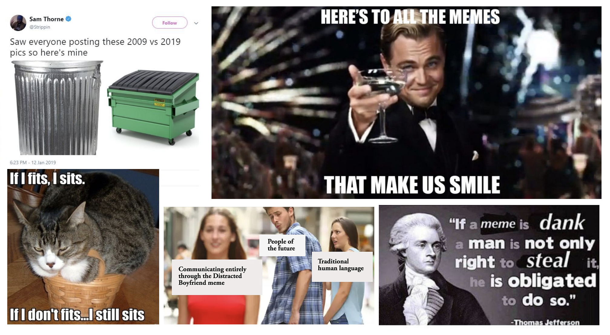

## Introduction
In today's digital world, memes have become a powerful way to convey emotions, humor, and social commentary. They blend images and text in a way that feels universal, but analyzing their meaning can be tricky. To tackle this challenge, I started a project to build a Multimodal Sentiment Analysis System. This system aims to understand and predict the emotions expressed in memes using advanced machine learning techniques. By integrating both natural language processing and image analysis, the project shows how AI can  interpret the nuances of human expression in online content.

Here shows several examples of memes learned in this project.

## Data Preparation and Preprocessing
The project commenced with data preparation, where the dataset comprised a collection of memes annotated with both the text displayed on them and their sentiment labels. The text data was pre-processed using a pre-trained BERT model to generate feature vectors. BERT is a powerful transformer-based model designed for natural language processing tasks. What sets BERT apart is its ability to understand the context of a word in a sentence by looking at the words that come before and after it, hence the "bidirectional" nature. Its deep understanding of context makes it perticularly suitable for this project.

Concurrently, the image data underwent standardization to a uniform size and normalization using ImageNet’s mean and standard deviation to ensure compatibility with the pre-trained ResNet18 model used later for feature extraction. ResNet18 is a convolutional neural network architecture that is part of the Residual Network family. It consists of 18 layers, including convolutional, pooling, and fully connected layers. Its key feature is the use of residual blocks which allow the network to learn identity mappings, ensuring that information flows more effectively through the layers by "skipping" some connections. This design helps ResNet18 maintain performance and accuracy even with increasing depth, making it a popular choice for image classification tasks due to its relatively lightweight structure and effectiveness.

## Model Architecture and Training
The core of the project was the design and implementation of a neural network that integrates text and image feature vectors. The network architecture involved separate pathways for processing text and image data, using fully connected layers for each, followed by a fusion of these features through concatenation. This combined feature set was then fed into additional layers to facilitate complex pattern recognition and sentiment classification. The model was trained to predict five levels of sentiment, employing a CrossEntropyLoss function suitable for multi-class classification and optimized using the Adam optimizer.

Finaly, we apply our Multimodal Sentiment Analysis System on the test set. The system achieved a precision of 0.60 and recall of 0.71 for positively labeled memes, resulting in an F1-score of 0.65, indicating a reasonably strong performance for this category. In contrast, the performance for neutral sentiments was moderate with a precision of 0.31, recall of 0.28, and an F1-score of 0.29. However, the model struggled significantly with negative sentiments, managing only a precision of 0.08, recall of 0.02, and an F1-score of 0.03. Overall, the accuracy of the system stood at 51%, with macro and weighted averages for precision at 0.33 and 0.46, and for recall at 0.33 and 0.51, respectively. The varying performance underscores strengths and areas for improvement, particularly in better capturing features indicative of neutral and negative sentiments.

## Future Directions 
To enhance the performance of the Multimodal Sentiment Analysis System, future work should focus on improving its ability to accurately classify neutral and negative sentiments. This could involve refining the feature extraction methods to capture more nuanced indicators of sentiment present in both text and image data. Additionally, incorporating more diverse and balanced training data might help reduce bias towards positive sentiments. Implementing advanced machine learning techniques such as attention mechanisms or fine-tuning the pre-trained models specifically for sentiment analysis tasks may also lead to better feature representation and classification accuracy. Moreover, exploring different model architectures or hybrid fusion strategies could further optimize the integration of modalities and improve overall system performance across all sentiment categories.