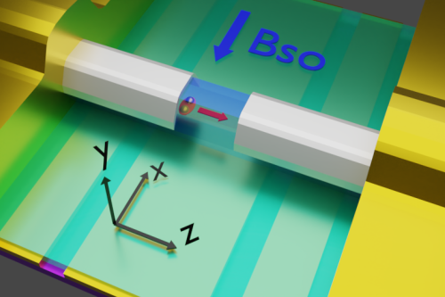

In quantum mechanics, the state of a system is represented by a wave function, which can be thought of as a complex-valued tensor. This tensor usually has a large number of indices, making it difficult to manipulate and compute. To overcome this problem, we can use tensor network representation, which provides a way to represent and manipulate large-scale quantum states efficiently.

For example, in a matrix product state (1d tensor network) representation, a quantum many-body state is represented as a chain of tensors, with one tensor for each site in the system. Each tensor has a physical index corresponding to the site's state and two auxiliary indices that connect the tensors together. The physical index of the tensors is contracted together to give the overall wave function of the system, and the auxiliary indices are used to represent the entanglement between the different sites.

In the MPS representation, the entanglement entropy between two parts of a pure system is related to the size of the auxiliary indices of the tensors in the MPS. The more entanglement there is between two parts of a system, the larger the auxiliary indices of the tensors in the MPS will be.

For the tensor network representation of a mixed state, the entanglement of purification (EP) plays the role of entanglement entropy. It indicates the size of the auxiliary indices of the tensors in the network we need to represent a mixed state accurately. But different from entanglement entropy, the exact value of EP is much harder to calculate. Therefore, we estimate it's upper and lower bounds instead.

Without knowing any detail of a quantum system, we can first investigate its typical properties by averaging over a random matrix ensemble. This method has been shown to be successful in reproducing many of the properties of many-body quantum systems, such as the level spacing and the distribution of eigenvalues. And by carefully choosing the proper ensemble, we can estimate the bounds of EP efficiently.

